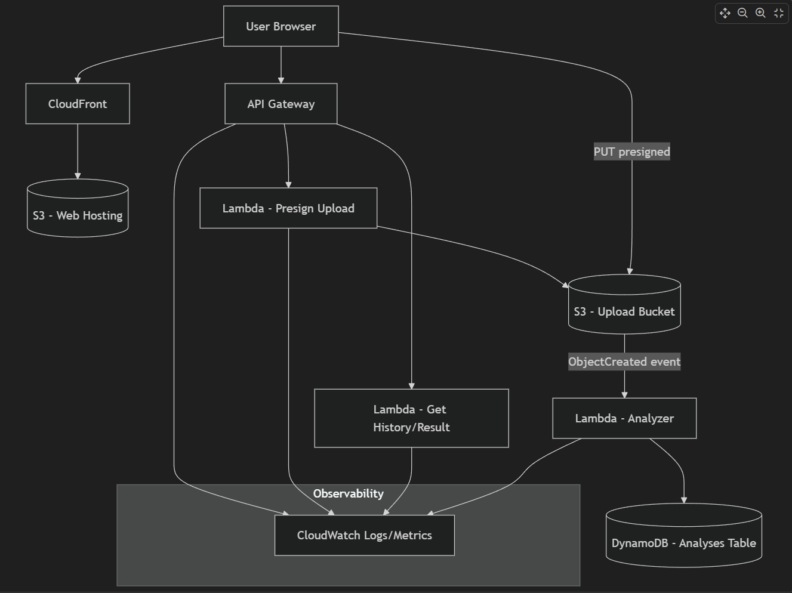
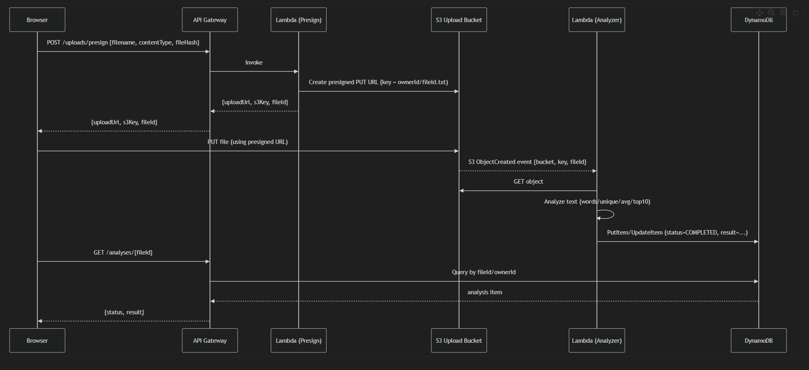
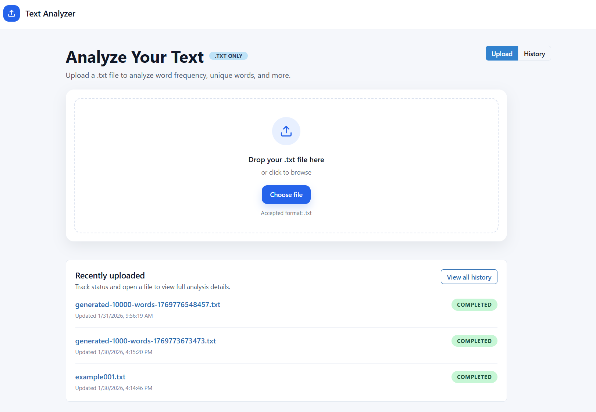
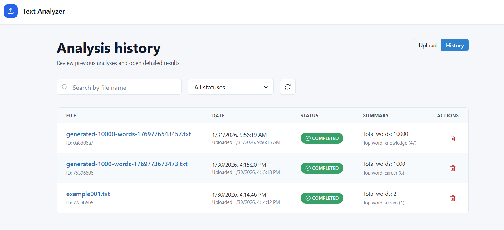
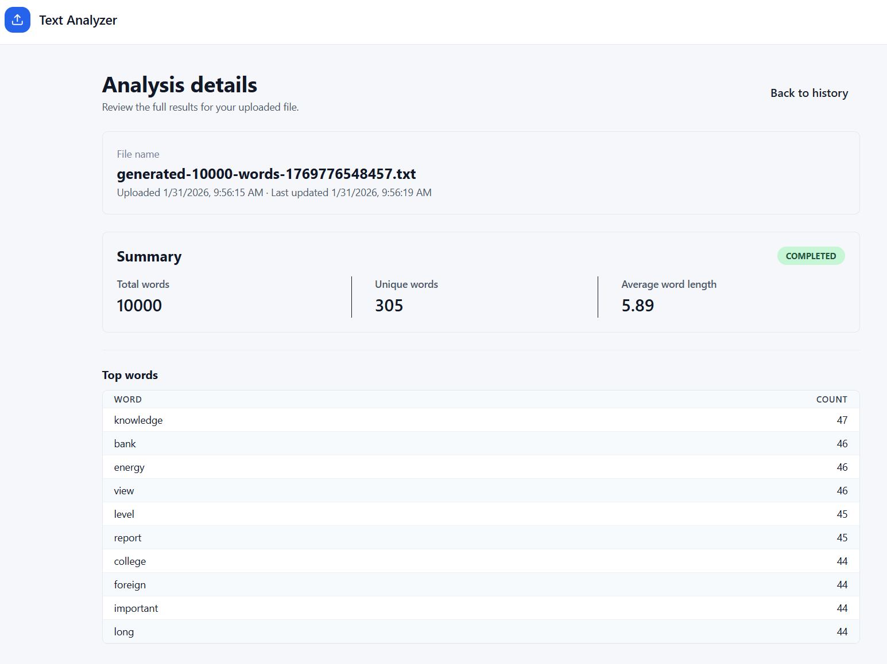

# Text Analyzer App

## System overview
Text Analyzer is an Nx monorepo with a React UI and an AWS Lambda API. Users upload text files, processing runs asynchronously, and results/history are stored in DynamoDB with files in S3.

## Setup and usage
1. Install dependencies: `npm install`
2. Run `./scripts/build-and-deploy.sh` to build the application and create resources in AWS.

## Assumptions and trade-offs
- Minimal DynamoDB single-table design for speed of delivery.
- No user authentication; an `ownerId` represents a caller.
- Inline results stored in DynamoDB for small payloads.
- fileID calculated by combining name, size and last modified
- Serverless-first (Lambda, S3, DynamoDB) to pay per use and avoid idle costs.

## Possible future improvements
- Add authentication and per-user access control.
- Add retries and TTL cleanup for jobs.
- Store large results in S3
- to improve scalability we can add SQS before lambda worker
- adding pagination to history table
- adding websocket updates for better perfromance and UX

## System Architecture

## Sequence Diagram

## Screenshots

### Text-Analyzer Upload Page

### Text-Analyzer History Page

### Text-Analyzer Analysis Page
